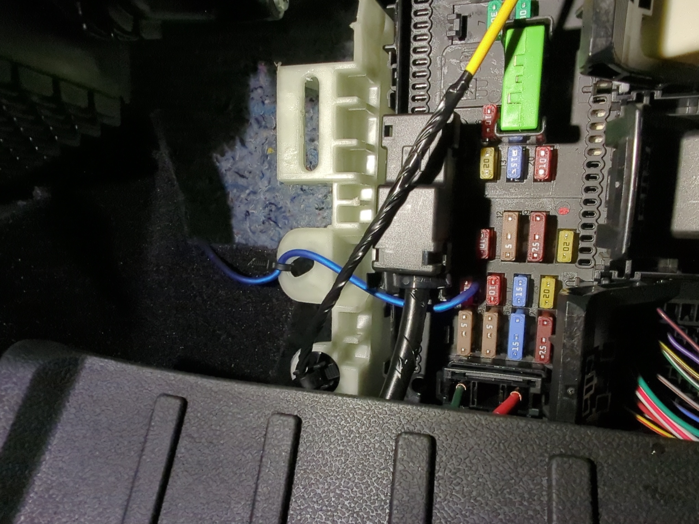

## Accessory Wire

    To get an accessory wire (one that was powered when the truck ignition was in accessory mode) I tapped
    fuse #3 in the fuse panel in the passenger foot well.  Make sure to tap on the upper side as I did to
    allow your accessory wire to be fused as well.

## Stock Radio Signal/Stock Speaker Wire Connection

    I used a PAC LPHFD31 LocPro Advanced T-Harness to connect into the stock radio wiring.
